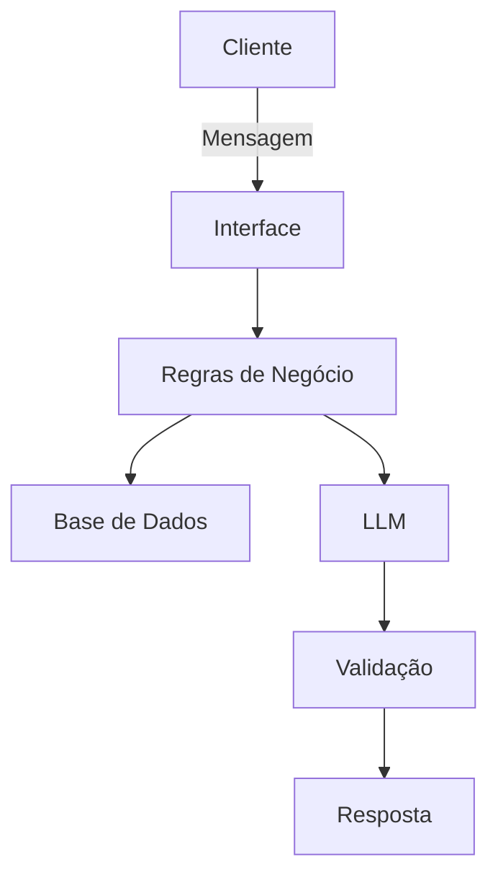

# Documentação do Agente

## Caso de Uso

### Problema
> Qual problema financeiro seu agente resolve?

Muitos clientes solicitam crédito sem compreender claramente o impacto das parcelas em sua renda, o que pode levar ao superendividamento e aumento do risco de inadimplência. Além disso, a análise de crédito tradicional pode ser pouco transparente, dificultando o entendimento dos critérios utilizados para aprovação ou reprovação.

O problema central é a falta de clareza e orientação no momento da simulação de crédito, o que gera decisões financeiras inadequadas.

### Solução
> Como o agente resolve esse problema de forma proativa?

O agente atua como um assistente inteligente de simulação de crédito, permitindo que o usuário insira dados básicos (renda, valor desejado, prazo, etc.) e receba:

Cálculo automático da parcela
Percentual de comprometimento da renda
Classificação de risco (baixo, médio ou alto)
Explicação clara da decisão
Recomendações para melhorar a aprovação

A solução combina regras determinísticas (cálculos e classificação) com IA generativa (explicação e orientação), garantindo respostas confiáveis e compreensíveis.

### Público-Alvo
> Quem vai usar esse agente?

Pessoas físicas interessadas em solicitar crédito
Clientes bancários que desejam simular empréstimos
Usuários com pouca educação financeira
Profissionais de atendimento que precisam de apoio rápido na análise de crédito

---

## Persona e Tom de Voz

### Nome do Agente
CreditAI – Assistente Inteligente de Crédito

### Personalidade
> Como o agente se comporta? (ex: consultivo, direto, educativo)

O agente possui um comportamento consultivo, educativo e orientado à decisão.
Ele não apenas apresenta resultados, mas também explica o raciocínio por trás da análise, ajudando o usuário a tomar decisões mais conscientes.

### Tom de Comunicação
> Formal, informal, técnico, acessível?

Acessível e claro
Levemente técnico, mas com explicações simples
Profissional, sem ser rígido

### Exemplos de Linguagem
- Saudação: "Olá! Posso te ajudar a simular um crédito e entender o risco dessa operação."
- Confirmação: "Entendi! Vou analisar os dados informados e calcular o risco para você."
- Erro/Limitação: "Não tenho dados suficientes para essa análise. Você pode me informar sua renda mensal e o valor desejado?"

---

## Arquitetura

### Diagrama

### Componentes

| Componente           | Descrição                                                               |
| -------------------- | ----------------------------------------------------------------------- |
| Interface            | Chat interativo desenvolvido em Streamlit                               |
| LLM                  | Modelo de linguagem (ex: GPT via API) para geração de explicações       |
| Base de Conhecimento | Dataset estruturado com dados simulados de clientes e regras de crédito |
| Regras de Negócio    | Cálculo da parcela, comprometimento de renda e classificação de risco   |
| Validação            | Garantia de que a resposta segue regras definidas e evita alucinação    |

---

## Segurança e Anti-Alucinação

### Estratégias Adotadas

- [ ] O agente só responde com base nos dados fornecidos pelo usuário
- [ ] A decisão de risco é baseada em regras fixas (não na IA)
- [ ] A IA é usada apenas para explicação e não para decisão
- [ ] Quando não possui dados suficientes, o agente solicita informações adicionais
- [ ] O agente não inventa valores ou simulações não calculadas
  
### Limitações Declaradas
> O que o agente NÃO faz?

Não substitui análise de crédito real de instituições financeiras
Não acessa dados externos ou históricos reais de crédito (ex: Serasa, SPC)
Não realiza aprovação formal de crédito
Não considera todas as variáveis do mercado financeiro (como taxa dinâmica, score real, políticas bancárias)
Não fornece aconselhamento financeiro completo ou personalizado fora do escopo da simulação
